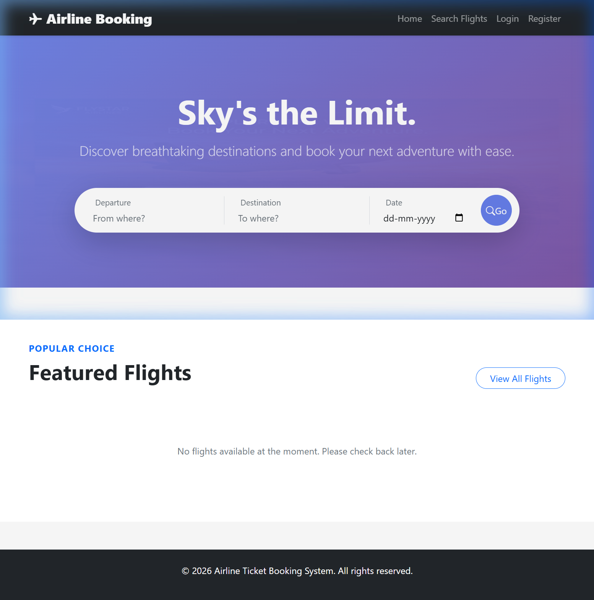
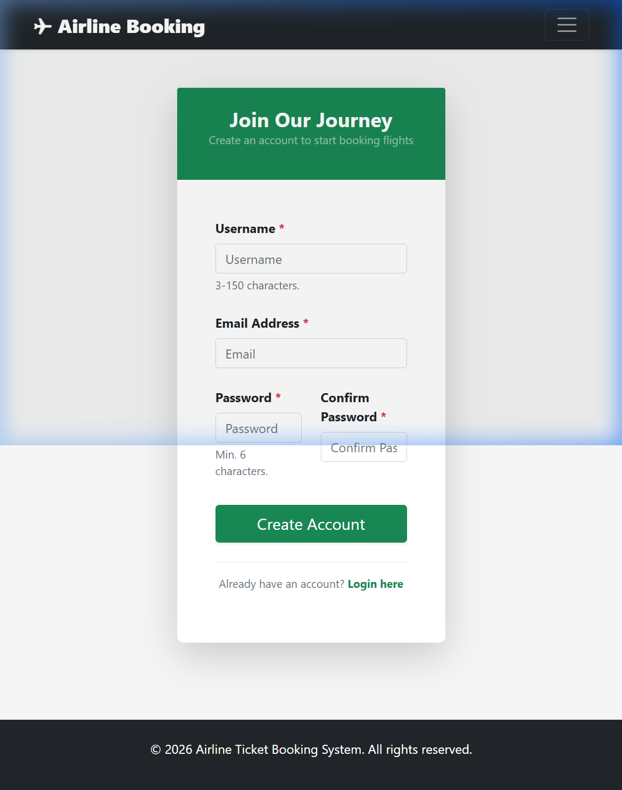

# ✈ SkyBound — Premium Airline Ticket Booking System

SkyBound is a production-grade, modular Django application designed for a scalable SaaS experience. It features a layered architecture, MongoDB integration, atomic reservation logic, and a high-end responsive UI.



## 📸 Snapshots

### 1. Dynamic Flight Discovery


### 2. Secure Enrollment

## 🏗 Architectural Overview

The project follows a **Modular Monolith** pattern, separating concerns into distinct layers to ensure maintainability and testability:

- **Presentation Layer**: Django Templates with Bootstrap 5 and Animate.css.
- **Application Layer (Services)**: Encapsulates all business logic (e.g., handling bookings, user registration).
- **Domain Layer (Repositories)**: Abstracts database queries from business logic.
- **Infrastructure Layer**: Configuration for MongoDB (Djongo), logging middleware, and environment-driven settings.

### 🧩 Module Breakdown
- **`apps.auth_app`**: Secure authentication & user enrollment.
- **`apps.flights`**: Advanced flight discovery and search engine.
- **`apps.bookings`**: Concurrency-safe ticket reservation system.
- **`apps.users`**: Comprehensive user profile management.
- **`apps.notifications`**: Real-time user alerting system.

---

## 🚀 Key Features

- **Atomic Seat Reservation**: Prevents overbooking using database-level `F()` expressions for atomic updates.
- **Modular Design**: Every feature is a self-contained module, allowing for easy expansion or migration to microservices.
- **MongoDB Integration**: Flexible schema handling via `Djongo` and NoSQL backend support.
- **Environment Isolation**: Separate settings for `development` and `production` with `.env` file support.
- **Premium UI**: 
  - Dynamic flight search with progress availability bars.
  - Interactive "Ticket View" and print-ready booking confirmations.
  - Glassmorphic card designs and smooth micro-animations.

---

## 🛠 Tech Stack

- **Backend**: Python 3.x, Django 4.2+
- **Database**: MongoDB (via `djongo` & `pymongo`)
- **Frontend**: HTML5, Vanilla CSS, Bootstrap 5, Bootstrap Icons, Animate.css
- **Infrastructure**: `python-dotenv` for configuration, `dnspython` for Atlas connectivity.

---

## 🏁 Getting Started

### 1. Prerequisites
- Python 3.10+
- MongoDB Atlas account (or local MongoDB instance)

### 2. Installation
```bash
# Clone the repository
git clone https://github.com/lavanya-2626/airline_project.git
cd airline_project

# Install dependencies
pip install -r requirements.txt
```

### 3. Environment Setup
Create a `.env` file in the root directory and configure the following:

```env
# Django Core
DEBUG=True
SECRET_KEY=your-secret-key-here
ALLOWED_HOSTS=localhost,127.0.0.1

# Database — MongoDB
MONGODB_URI=mongodb+srv://<username>:<password>@cluster.mongodb.net/airline_db?retryWrites=true&w=majority
```

### 4. Run the Application
```bash
# Apply migrations (Djongo handles this for MongoDB)
python manage.py migrate

# Start the server
python manage.py runserver
```

---

## 📂 Project Structure

```bash
airline_project/
├── apps/                   # Feature modules
│   ├── auth_app/           # Auth & Registration
│   ├── flights/            # Search & Discovery
│   ├── bookings/           # Reservation Logic
│   └── users/              # Profiles
├── airline_project/        # Root config & Settings
│   └── settings/           # base/dev/prod configs
├── static/                 # CSS, JS, and Images
├── templates/              # Tiered template structure
├── .env                    # Environment variables
└── manage.py
```

## 🛡 Security & Performance
- **Data Protection**: All sensitive keys are externalized to `.env`.
- **Query Optimization**: Repository pattern ensures efficient database indexing and query patterns.
- **Thread Safety**: Atomic operations ensure data integrity under high concurrent booking loads.

---

Developed with ❤️ as a Modular SaaS Template.
